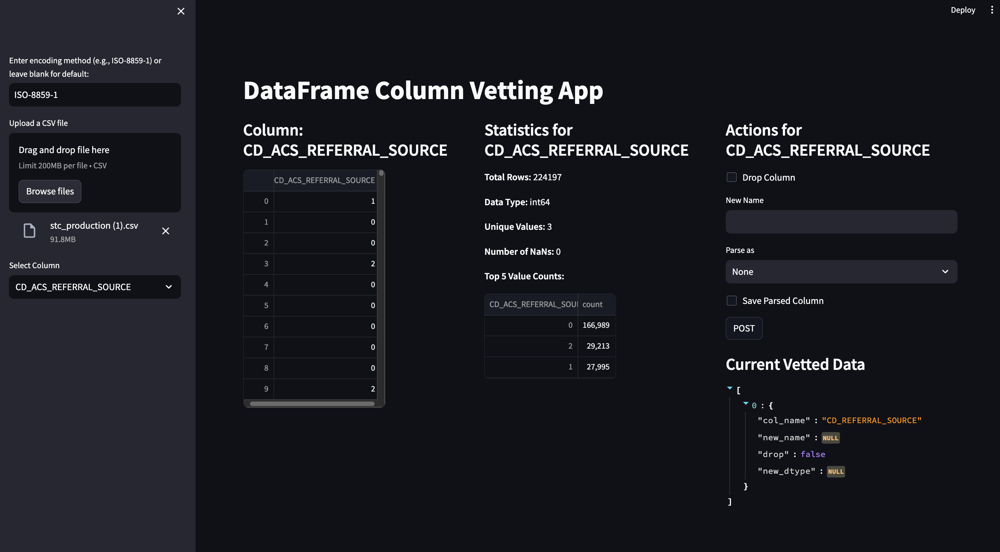

# colstats



colstats is a graphical user interface tool designed to streamline the process of vetting and preprocessing columns in a dataframe. It generates JSON instructions that can be used to automate column removal and modification during the modeling process.

## Features

- Eliminates manual labeling through Excel
- Generates JSON instructions for language-agnostic dataframe preprocessing
- Simplifies column management in data analysis workflows

## Installation

1. Clone this repository
2. Install the required dependencies:

```bash
pip install streamlit pandas
```

Or if you prefer using conda:

```bash
conda install streamlit pandas
```

## Usage

Run the application with:

```bash
streamlit run app.py
```

The app will open in your default web browser. If it doesn't, check the terminal for the Local URL.

## File Structure

The entire application is contained in a single file: `app.py`

## Requirements

- streamlit
- pandas

## Note

This app must be run using `streamlit run app.py`. It cannot be executed like standard Python scripts.
